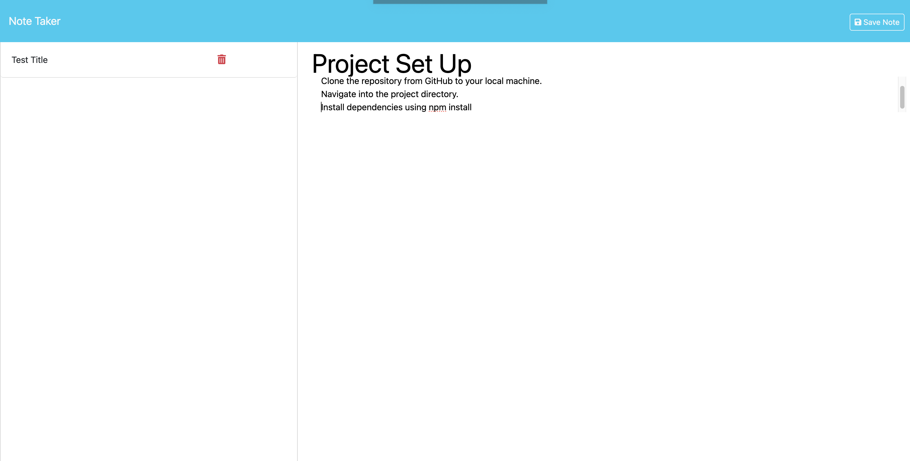
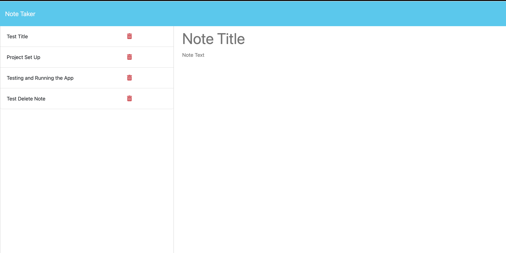

# Note-Taker

## Description
The project is a note-taking application designed for small business owners to write and save notes, helping them organize thoughts and track tasks they need to complete.

## Table of Contents
Installation
Usage
License
Contributing
Tests
Questions

## Installation
To correctly complete the command-line, the user should run the command: "npm install"

## Usage
To use the application, the user should use the command : "node server.js"
To correctly run the test, use the command: "npm start"

## Accessing the Server

Open your web browser and go to: (http://localhost:3001)

## Using the Application
Viewing Notes:
When you access the application in your web browser, you will see the landing page where you can click on "Get Started" to view the notes page.

Adding a Note:
On the notes page, you can enter the title and text for your new note in the provided fields and click the save button to save the note.

Deleting a Note:
Each note will have a delete icon next to it. Click the delete icon to remove the note from the list.

By following these steps, you can successfully set up, access, and use the Note-Taker application.

## License
This project is licensed under the MIT license.

## Contributing
To contribute, please fork the repository and use a feature branch. Feel free to run pull requests as well.

## Tests
To correctly run the test, use the command: "npm test"

## Questions
If you have any questions, please open an issue or contact me directly at [ashleydvon@yahoo.com]. You can find more of my work at (https://github.com/AshleydVon).

## Github:
(https://github.com/AshleydVon/Note-Taker)

## Deployed Live Website:
(https://ashleydvon.github.io/Note-Taker/)

## Screen-Shots
| Image | Description |
| --- | --- |
|  | 1st Note Added |
|  | 2nd Note Added |
|  | All Notes Added |
|  | Saving a Test Delete Note |
| ![screenshot3](./assets/All-Deleted.png | All Notes Successfully Deleted |